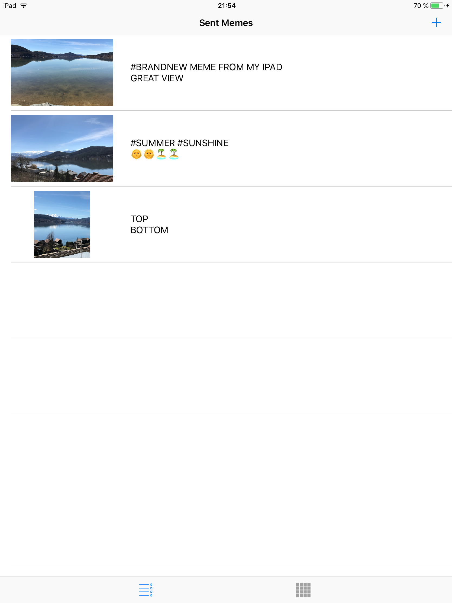

# MemeMe
A funny photo editor that let's you share Memes with your friends

In the "Edit and share screen" it is possible to add photos from gallery or camera and add a top and bottom text as well as share or save the Meme:

There's also an overview of created Meme's:

If a Meme is clicked on, another screen showing the Meme is shown.
